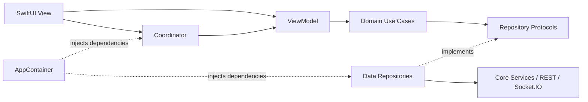

# FamilyTracker · Life360 Alternative

**Real-time family location sharing, built with native SwiftUI and a layered Node.js backend.**


FamilyTracker brings **live maps, Circle-based sharing, emergency SOS, group and
direct messaging, and journey analytics** into one iOS application. The engineering
focus is practical: isolate business logic, centralize navigation, adapt location
accuracy to motion and battery conditions, and recover gracefully from connectivity changes.

This repository contains the **native iOS client**. The companion
[Node.js backend](https://github.com/Lyquang/Life360-BackEnd) is maintained separately.
It is an independent portfolio project, not affiliated with Life360 and not a
replacement for emergency services. Feature status below reflects the inspected
source, not a claim of production certification or guaranteed delivery.

[Features](#-key-features) · [Architecture](#-technical-architecture) ·
[Quick Start](#-quick-start) · [Verification](#-verification) · [Roadmap](#-delivery-status)

## ✨ Key Features

| Capability | Engineering highlights | Current scope |
| --- | --- | --- |
| **Real-time Location Tracking** | MapKit member pins, battery levels, presence and location updates via Socket.IO | Implemented; initial map population relies on realtime events |
| **Emergency SOS** | Circle-wide SOS events, app-wide alert banner and coordinator-driven map focus | Implemented banner flow; fullscreen alarm/siren and Critical Alerts are not implemented |
| **Smart Background & Battery Saving** | CoreLocation + CoreMotion policy adjusts accuracy, distance filter and significant-change monitoring | Implemented adaptive policy; no measured battery-saving percentage claimed |
| **Real-time Chat & Media** | Circle/direct conversations, cursor pagination, typing, image preparation, presigned upload and REST message creation | Implemented client flows; storage needs backend S3/R2 credentials; mark-as-read API exists, per-message read-receipt UI is not implemented |
| **Journey & Stay-Point Analytics** | Date-based history, stay-point/moving-segment timeline and reverse geocoding | Implemented screens and backend analytics; journey DTO compatibility remains a follow-up in [PROGRESS.md](PROGRESS.md) |
| **Places & Notifications** | Saved places, stay-duration alerts, local chat/SOS notifications and per-account settings | Saved places are not enter/exit geofences; remote APNs delivery still needs backend integration |
| **Vietnamese / English** | In-app language selection, persisted preference and localized UI/errors/durations | Available from Login and Profile settings |
| **Developer Observability** | Pulse network inspector, sanitized diagnostics and JSON export for AI-assisted investigation | Debug tooling; no automatic log transmission to an LLM |

### Battery-aware tracking, not a fixed GPS loop

| Motion / power state | Policy in the iOS client |
| --- | --- |
| Stationary | Significant-change monitoring; reduced precision |
| Walking / running | Approximately 10 m requested accuracy, 20 m distance filter |
| Cycling | Approximately 10 m requested accuracy, 30 m distance filter |
| Automotive | Navigation accuracy, 50 m distance filter |
| Low Power Mode / battery below 20% | Lower precision and double the distance filter |

Requested accuracy is a system hint, not a guarantee. Unknown motion uses a
moderate tracking policy; permission, device conditions and iOS scheduling still
govern delivery. See [AdaptiveLocationPolicy.swift](FamilyTracker/Core/Location/AdaptiveLocationPolicy.swift).

## 🧭 Technical Architecture

### Native iOS: MVVM-C + Clean Architecture



- **Views render; ViewModels own UI state.** The current implementation uses
  Combine `ObservableObject`, `@Published` and `@StateObject` for an **iOS 16+**
  baseline. It does **not** claim adoption of iOS 17's `@Observable` Observation framework.
- **Coordinators own navigation.** Auth, tabs, chat, map, timelines and emergency
  presentation are separated from business logic. Notification taps enter this
  routing layer; access is checked before opening chat/member content.
- **Domain stays platform-independent.** Repository protocols and use cases
  separate workflows from URLSession, Keychain, CoreLocation and Socket.IO adapters.
- **Composition Root, not scattered construction.**
  [AppContainer.swift](FamilyTracker/App/DI/AppContainer.swift) wires repositories,
  services and use cases; platform capabilities are centralized in `Core/`.
- **Concurrency and ownership are explicit.** MainActor presentation state,
  async/await REST calls, AsyncStream realtime subscriptions, cancellation and
  weak captures support predictable lifecycle management. Strict Swift 6 migration
  is not claimed by this Swift 5 project.
- **Typed boundaries.** Codable DTOs map to domain entities; authenticated requests
  use Keychain-backed Bearer tokens, with API errors translated at repository boundaries.

### Backend: dependency direction matters

The companion backend separates **Domain, Application, Infrastructure and Presentation**.
Presentation invokes application use cases; infrastructure implements their dependencies;
the composition root in `src/container.js` injects repositories, token services,
storage, realtime delivery and a unit of work. Domain does not depend on Express
or Mongoose. This is a service-oriented modular backend, not a claim of microservices.

The backend's stay detector groups consecutive points within an **80 m radius**
for at least **5 minutes**, then derives moving segments. These are inspectable
algorithm parameters, not benchmark or accuracy claims.

### Realtime and media paths

```text
Location -> adaptive CoreLocation policy -> domain use case -> Socket.IO
         -> authenticated user/Circle rooms -> member state -> MapKit

Image -> compress + metadata -> upload ticket -> HTTP PUT to S3/R2
      -> REST create image message -> Socket.IO delivery to conversation room

Notification tap -> pending route -> authenticated session -> membership check
                 -> ChatCoordinator / MapCoordinator
```

Socket.IO adds event framing, rooms and reconnection behavior on top of its
transport; it is not interchangeable with a raw WebSocket client. The backend
uses user, Circle and conversation rooms.

The local [OfflineQueue](FamilyTracker/Data/Local/OfflineQueue/OfflineQueue.swift)
persists bounded outgoing events, coalesces location updates and replays on reconnect
(200 items, 24-hour expiry). This is **best-effort buffering**, not a full offline
chat database or acknowledged exactly-once delivery. Coalescing prioritizes the
latest location, not preservation of every historical point.

## 📂 Directory Structure

**Actual layout of this repository:** the iOS source folder is `FamilyTracker/`,
not `FamilyTrackerApp/`, and the backend is not vendored here.

```text
.
├── FamilyTracker.xcodeproj/       # Checked-in Xcode project
├── FamilyTracker/
│   ├── App/                       # Entry point, lifecycle, DI, event bridge
│   ├── Presentation/              # SwiftUI scenes, ViewModels, Coordinators
│   ├── Domain/                    # Entities, protocols, use cases, errors
│   ├── Data/                      # REST DTOs/mappers, repositories, local storage
│   ├── Core/                      # Location, sockets, notifications, logging
│   └── Resources/                 # Assets, Info.plist, vi/en localization
├── Tests/                         # Networking, localization, notification tests
├── scripts/                       # Test runners and codebase skeleton
├── .spec/                         # Feature specifications
├── FamilyTracker.entitlements
├── project.yml                    # XcodeGen definition
├── AI_RULES.md                     # Architectural and agent constraints
└── PROGRESS.md                     # Status, decisions and verification gaps
```

**Suggested two-repository checkout** (`FamilyTrackerApp/` is an optional local alias):

```text
workspace/
├── FamilyTrackerApp/              # This repository, layout shown above
└── backend/                       # Separate Life360-BackEnd checkout
    ├── server.js
    ├── src/
    │   ├── domain/                # Framework-independent business rules
    │   ├── application/           # Feature use cases
    │   ├── infrastructure/        # MongoDB, Socket.IO, S3, security adapters
    │   ├── presentation/          # Express routes, socket gateways, DTO validation
    │   ├── config/
    │   └── container.js           # Dependency injection composition root
    ├── tests/
    ├── .env.example
    ├── Dockerfile
    └── package.json
```

## 🚀 Quick Start

### Prerequisites

| Tool | Requirement |
| --- | --- |
| macOS + Xcode | Xcode supporting synchronized folders (16+); iOS deployment target 16.0; Debug Simulator build checked with Xcode 26.2 |
| Swift Package Manager | Xcode resolves Socket.IO and Pulse from project dependencies |
| iPhone / Simulator | Simulator for UI; physical device for realistic motion, battery, background GPS and APNs testing |
| Apple signing | Your own Team/Bundle ID; APNs-capable provisioning for push entitlements |
| Node.js / npm | Node.js 20+ for the separate backend; inspect its `package.json` for future changes |
| MongoDB | Local instance or Atlas connection string; replica-set deployment for transaction-dependent flows |
| Optional | Docker for backend; XcodeGen to regenerate the project; S3/R2 for image uploads |

### 1. Run the iOS client against the deployed API

Open this repository in Terminal:

```bash
open FamilyTracker.xcodeproj
```

Select scheme **FamilyTracker**, allow package resolution, choose an iPhone
Simulator and Run. For a physical device, select your own signing Team and a
matching Bundle Identifier, enable Developer Mode as required and grant the
location/motion/notification permissions you intend to test.

Both Debug and Release currently use the **deployed HTTPS backend**, not localhost:

| Connection | Configured URL |
| --- | --- |
| REST | `https://life360-backend-latest.onrender.com/api/v1` |
| Socket.IO | `https://life360-backend-latest.onrender.com` |

The source of truth is [AppEnvironment.swift](FamilyTracker/App/DI/AppEnvironment.swift).
No production credentials are embedded in this guide, and backend availability
is not guaranteed. Use dedicated test accounts and consented test locations.
Running a backend locally does **not** automatically redirect the mobile app.

**Unsigned Simulator build:**

```bash
xcodebuild -project FamilyTracker.xcodeproj -scheme FamilyTracker \
  -configuration Debug -sdk iphonesimulator \
  -destination 'generic/platform=iOS Simulator' \
  CODE_SIGNING_ALLOWED=NO build
```

### 2. Run the companion backend independently

These commands run in a **separate checkout**, not this iOS repository:

```bash
git clone https://github.com/Lyquang/Life360-BackEnd.git backend
cd backend
npm ci
cp .env.example .env
```

Edit `.env` with your own values. Minimum example:

```dotenv
NODE_ENV=development
PORT=3000
MONGODB_URI=mongodb://127.0.0.1:27017/location-sharing-app
JWT_SECRET=replace-with-a-long-random-secret
JWT_EXPIRES_IN=7d
JWT_REFRESH_EXPIRES_IN=30d
TZ=Asia/Ho_Chi_Minh
CORS_ORIGIN=http://localhost:3000
```

Generate a secret with `openssl rand -hex 32`; never commit `.env`, access tokens,
real locations or signing keys. Native clients do not use browser CORS enforcement;
set explicit browser origins appropriate to your deployment.

```bash
npm run dev
```

For the normal Node entry point use `npm start`. For an image-based deployment:

```bash
docker build -t familytracker-backend .
docker run --rm --env-file .env -p 3000:3000 familytracker-backend
```

The Docker command runs the API only, **not MongoDB**. Use an Atlas/container-reachable
`MONGODB_URI`; `127.0.0.1` inside that API container is not your host MongoDB.
The Docker image uses production mode, so supply explicit production-safe settings.

Image uploads additionally need the backend's `S3_BUCKET`, `S3_REGION`,
`S3_ACCESS_KEY_ID`, `S3_SECRET_ACCESS_KEY`, `S3_PUBLIC_BASE_URL` and optional
`S3_ENDPOINT` for R2. With storage unset, the upload-ticket endpoint returns 503.
Consult the backend's checked-in `.env.example` rather than embedding storage
secrets in the mobile app.

### 3. Notifications and App Icon

Open **Profile → Settings → Notifications** for master/chat/SOS preferences and
the iOS permission recovery action. Preferences are currently device-local and
account-scoped; **remote APNs delivery is not yet connected to the backend**.

Push/Time Sensitive entitlements are configured in the project, but Apple signing
and backend registration are separate requirements. `remote-notification` does
not make sockets run indefinitely. Critical Alerts require separate Apple approval.

The `AppIcon` catalog is configured but has no artwork yet. Import an opaque
1024×1024 PNG into its universal iOS slot; Xcode generates the required sizes.
See [NOTIFICATIONS.md](NOTIFICATIONS.md) for capabilities, payload contract,
remaining server work, icon instructions and a physical-device test checklist.

## 🧪 Verification

Run from this repository root:

```bash
bash scripts/test_networking.sh
bash scripts/test_localization.sh
bash scripts/test_notifications.sh
```

| Check | Scope |
| --- | --- |
| Networking contracts | 26 documented REST examples, DTO round trips, request contracts, authorization and transport errors |
| Localization | Key/format parity, saved language, errors and durations; 249 translations at this revision |
| Notification settings | Account isolation, persistence, category gating, bounded dedupe, ViewModel state and error recovery |
| Simulator build | Compilation and integration; not proof of physical APNs or background GPS behavior |

The existing Login language UI test requires XcodeGen and a booted Simulator with
the app installed and logged out:

```bash
SIMULATOR_ID=<booted-simulator-udid> bash scripts/test_localization_ui.sh
```

Do not confuse contract tests with live production integration tests. Notifications
on locked devices, battery behavior, remote push delivery, and authenticated UI
flows need separate device/account testing. Backend tests run independently with
`npm test` in the backend checkout.

## 🛠 Engineering Notes

| Topic | Read more |
| --- | --- |
| Architecture and ownership rules | [AI_RULES.md](AI_RULES.md) |
| Implementation status and known gaps | [PROGRESS.md](PROGRESS.md) |
| REST and realtime contracts | [API_INTERGRATION.MD](API_INTERGRATION.MD) |
| Swift patterns with source references | [FRONTEND_SWIFT_DESIGN_PATTERNS.md](FRONTEND_SWIFT_DESIGN_PATTERNS.md) |
| Language switching | [LOCALIZATION.md](LOCALIZATION.md) |
| Push, settings and icon setup | [NOTIFICATIONS.md](NOTIFICATIONS.md) |
| Spec-driven work, AST/graph tooling, Memory MCP and Pulse | [TOOLING.md](TOOLING.md) |

AI-assisted workflows support engineering decisions; they do not replace code
review or tests. `scripts/codebase_skeleton.sh` provides a compact source overview;
specs document scope before changes, and `PROGRESS.md` records verification limits.

## 📌 Delivery Status

- **Available:** native map/chat/history/places screens, adaptive location services,
  REST/Socket.IO integration, bilingual UI, local notification settings and Pulse diagnostics.
- **Next integration steps:** APNs provider and device registration/preferences APIs,
  server-side notification filtering, unread badge reconciliation, robust cold-start
  incident-location retrieval, and complete physical-device notification validation.
- **Not advertised as shipped:** fullscreen SOS siren, Critical Alerts, enter/exit
  geofence notifications, per-message read-receipt UI, `@Observable` migration,
  completed icon artwork or guaranteed offline/event delivery.

**Privacy first:** location and message data are sensitive. Share only with consent,
keep credentials out of source control, and review any exported diagnostics before
sharing them with people or AI tools.
